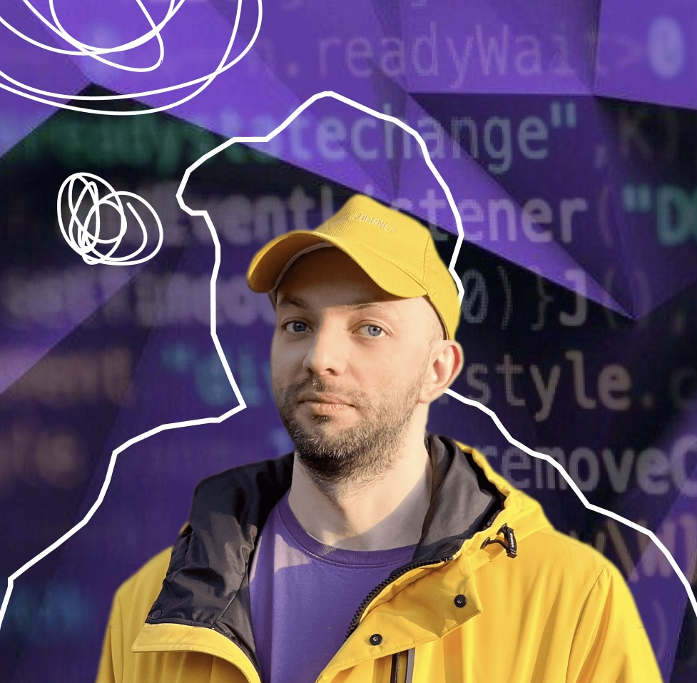
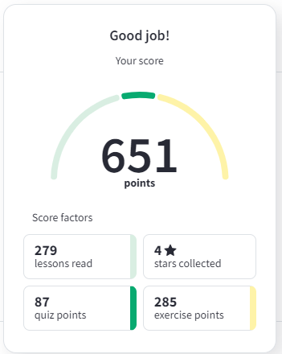
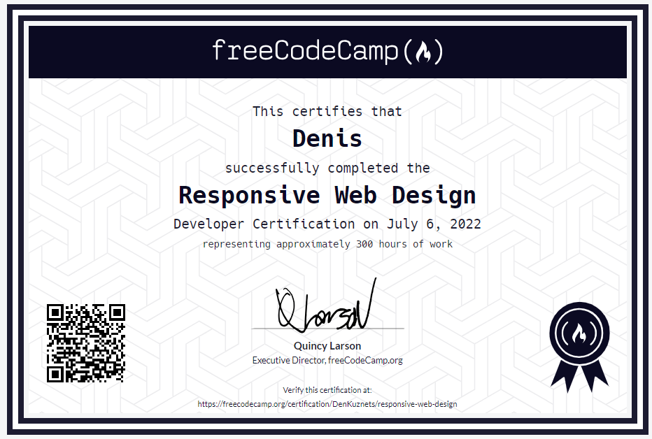
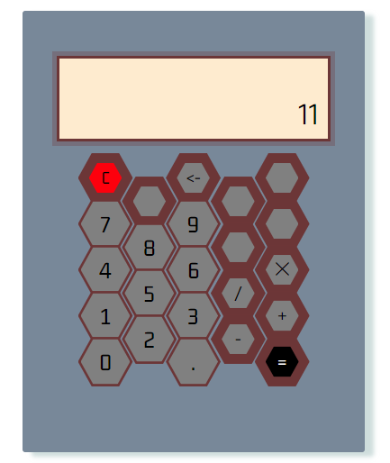
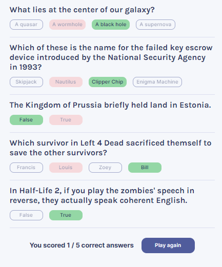
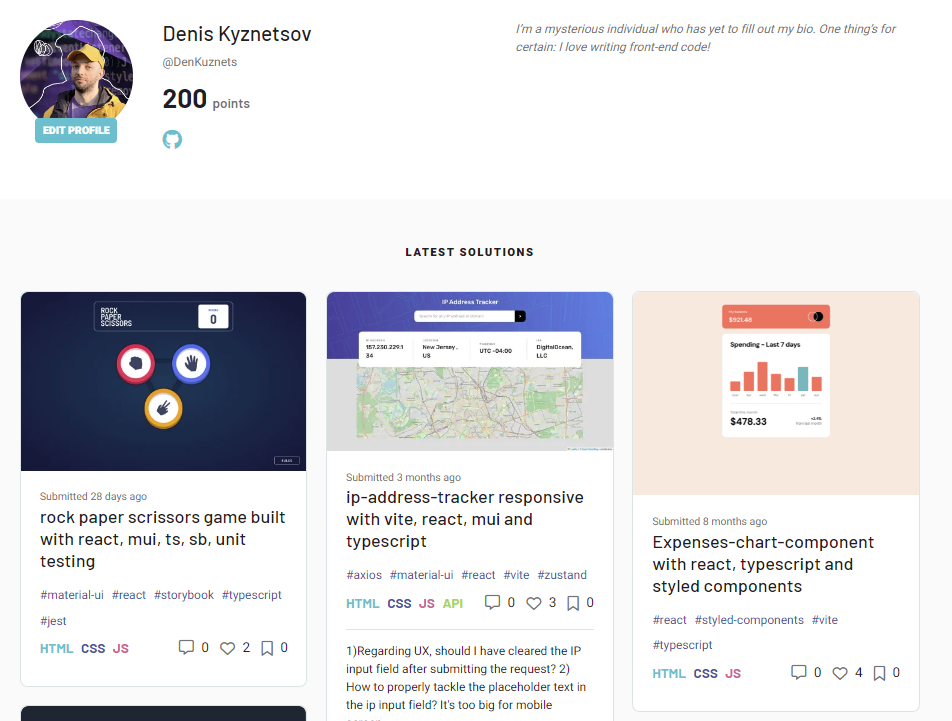
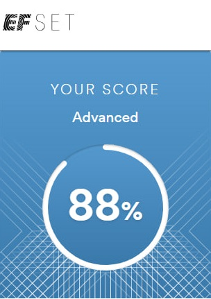

### [rsschool-cv](https://DenKuznets.github.io/rsschool-cv/)

***

# Denis Kuznetsov

### Frontend-developer



---

## Contact information

Phone +79969191309

E-mail: denis.kyznecov@gmail.com

Telegram: [@DenKuznets](https://t.me/DenKuznets)

Discord: DenKuznets (@DenKuznets)

[Personal Website](https://denkuznets.vercel.app/)

[GitHub](https://github.com/DenKuznets)

---

## About me

I've been doing web development since 2022. I keep studying new technologies and follow the latest frontend innovations. My knowledge of English allows me to receive information first-hand without waiting for translation. I have some experience in commercial development. I worked part-time in a web studio collaborating with a backend programmer and web designer and now know how to meet a deadline while keeping all the important parts of a site pixel perfect to Figma design.

---

## Skills

```REACT```  ```NEXTJS``` ```TAILWIND``` ```TS``` ```MUI``` ```REDUX``` ```REST``` ```UNIT TESTING``` ```STORYBOOK``` ```STYLED-COMPONENTS``` ```HTML CSS JS```

<sup>(for every listed skill here I have at least one project demo in my portfolio)</sup>

---

## Code example

Codewars | ```7 kyu``` | Determine if the poker hand is flush

<sub>Determine if the poker hand is flush, meaning if the five cards are of the same suit.
Your function will be passed a list/array of 5 strings, each representing a poker card in the format "5H" (5 of hearts), meaning the value of the card followed by the initial of its suit (Hearts, Spades, Diamonds or Clubs). No jokers included.
Your function should return true if the hand is a flush, false otherwise.
The possible card values are 2, 3, 4, 5, 6, 7, 8, 9, 10, J, Q, K, A</sub>

```
function isFlush(cards) {  

  for(let i = 0; i < cards.length - 1; i++){
    if(cards[i][cards[i].length - 1] !== cards[i + 1][cards[i + 1].length - 1]) return false;
  }

  return true ;
}
```

---

## Work Experience

Part time job in a web studio [Alex Media ](https://alex-media.ru/)

Completed projects (landings):

[Tula energo service](https://tul-energo-service.ru/) | [Github](https://github.com/DenKuznets/tes.loc)

[Techauto](https://avtodom-techauto.ru/) | [Github](https://github.com/DenKuznets/teh-avto.loc)

[BMK](https://bmk78.ru/) | [Github](https://github.com/DenKuznets/bmk-new.loc)

[Cleaning company Chistyla](https://chistylya.ru/) | [Github](https://github.com/DenKuznets/cleaning-chistulya.loc)

[Municipal baths site](https://mup-komfort.ru/) | [Github](https://github.com/DenKuznets/myp-comfort)

---

## Education

* [w3cschool](https://www.w3schools.com/) html, css and js tutorials



* Freecodecamp Responsive Wev Design Course



* [The odin project](https://www.theodinproject.com/) has a great frontend starter course despite being a fullstack developer dedicated site. The final project of the Foundation course was a [calculator](https://www.theodinproject.com/lessons/foundations-calculator). I designed it myself and tried to replicate the basic functionality and edge use cases of the Citizen desktop calculator using my own logic - [project demo](https://denkuznets.github.io/calculator-odin/). 



* [Scrimba.com](https://scrimba.com/) is an amazing resource for learning and Bob Ziroll is a god tier teacher. It's been a pleasure to follow his react course and I'm really glad he's made it free for everyone. Final [project](https://denkuznets.github.io/quizzical-app/) featured state management and usage of rest api.



* [Frontendmentor](https://www.frontendmentor.io/) has been an outstanding source of interesting and fun frontend challenges. Whenever I need a nicely designed training dummy to try out a skill I just learned, I always go to this site.




* These were just the highlights of my learning journey, and I visited many more interesting resources, watched dozens of hours of YouTube videos, and read many books. Some of them I would like to mention here:

    Youtube channels: [Brad Traversy Media](https://www.youtube.com/channel/UC29ju8bIPH5as8OGnQzwJyA), [Codevolution](https://www.youtube.com/@Codevolution), [Wes Bos](https://www.youtube.com/@WesBos), [John Smilga's Coding Addict](https://www.youtube.com/c/codingaddict)

    Books: [Head First book series](https://en.wikipedia.org/wiki/Head_First_(book_series)), [Test Driven Development by Kent Beck](https://www.amazon.com/Test-Driven-Development-Kent-Beck/dp/0321146530), [Think Like a Programmer by Anton Spraul](https://www.amazon.com/Think-Like-Programmer-Introduction-Creative/dp/1593274246)

I keep up with all new trends in frontend by following these great [frontend](https://roadmap.sh/frontend) and [react](https://roadmap.sh/react) roadmaps. You can even check my progress there - [frontend](https://roadmap.sh/frontend?s=646af642cb6301e67f87c307), [react](https://roadmap.sh/react?s=646af642cb6301e67f87c307).

---

Languages:
* English B2



* Russian - Native